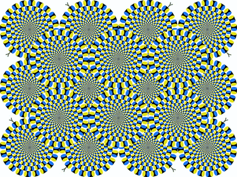

# Which One Is Real? — 蛇の回転錯視 × 現代アート

**「全てが回転して見える。しかし、本当に回転しているのはひとつだけ。」**

北岡明佳教授の「蛇の回転錯視（Rotating Snakes Illusion）」を素材に、錯視と物理的回転の境界を問うインタラクティブアート作品です。


## コンセプト

蛇の回転錯視は、静止画であるにもかかわらず、円形ディスクが回転して見える強力な運動錯視です。この作品では、画像中央に並ぶ6個のディスクのうち1個を**実際に回転**させます。20秒かけて1回転し、5秒間静止した後、別のディスクがランダムに選ばれて回転を始めます。

観察者は「全てが動いて見える」錯視の中から「本物の回転」を見つけ出すという、知覚と現実の境界に立たされます。興味深いことに、蛇のパターンは準回転対称であるため、ゆっくりとした物理的回転は錯視による見かけの回転と区別が極めて困難です。

## ファイル構成

| ファイル | 用途 |
|---|---|
| `rotating_snakes_exhibition.py` | 展示会用プログラム（Python/Pygame） |
| `generate_gif.py` | GIF/MP4生成スクリプト |
| `rotating_snakes_art.mp4` | SNS投稿用MP4（640×480, 75秒, 4.2MB） |
| `rotating_snakes_sns.gif` | SNS用GIF フル版（480×360, 75秒, 3.8MB） |
| `rotating_snakes_sns_short.gif` | SNS用GIF ショート版（1サイクル, 1.3MB） |
| `KitaokaPosi_640.jpg` | 元画像（北岡明佳教授による蛇の回転錯視） |

## 展示版の使い方

### 必要環境

```
pip install pygame Pillow
```

### 実行

```bash
# KitaokaPosi_640.jpg と同じディレクトリで実行
python rotating_snakes_exhibition.py
```

### 操作

- **F** — フルスクリーン切替
- **ESC / Q** — 終了

### カスタマイズ

`rotating_snakes_exhibition.py` 冒頭の設定値を変更できます。

```python
SCALE = 2               # 表示倍率（2=1280x960, 3=1920x1440）
ROTATION_DURATION = 20.0 # 1回転の秒数（大きいほど判別困難）
PAUSE_DURATION = 5.0     # 回転間の静止時間
FULLSCREEN_START = False  # True で起動時フルスクリーン
```

展示環境に合わせて `SCALE` をモニター解像度に調整してください。`ROTATION_DURATION` を30〜40秒に伸ばすと、錯視との区別がさらに難しくなります。

## GIF/MP4の再生成

```bash
python generate_gif.py
```

`generate_gif.py` 内の設定で回転パラメータを調整できます。

```python
ROTATION_SECS = 20.0    # 1回転の秒数
PAUSE_SECS = 5.0        # 静止時間
NUM_CYCLES = 3           # サイクル数
DISK_PLAN = [4, 1, 3]   # 回転ディスクの順番（0-5、下図参照）
```

### ディスク番号

```
┌─────────────────────────────┐
│     [0]     [1]     [2]     │  上段
│        (160,160) ...        │
│     [3]     [4]     [5]     │  下段
│        (160,320) ...        │
└─────────────────────────────┘
```

## 技術メモ

- ディスクは元画像から円形マスクで切り出し、PIL の `rotate()` で回転後に元位置へ再合成しています
- 蛇の回転錯視のパターンは準回転対称のため、90度回転時でもピクセル差分の最大値は42/255程度と小さく、これが「本物の回転が見分けにくい」という作品効果の物理的根拠になっています
- GIF は ffmpeg の palettegen/paletteuse パイプラインで最適化（差分モード + Bayer ディザリング）

## クレジット

- 蛇の回転錯視（原画像）: **北岡明佳**（立命館大学）
- アート作品制作: エイジ（英治）

## ライセンス

元の錯視画像の著作権は北岡明佳教授に帰属します。本作品を公開・展示する際は、元画像の使用許諾を別途ご確認ください。

## 作例

