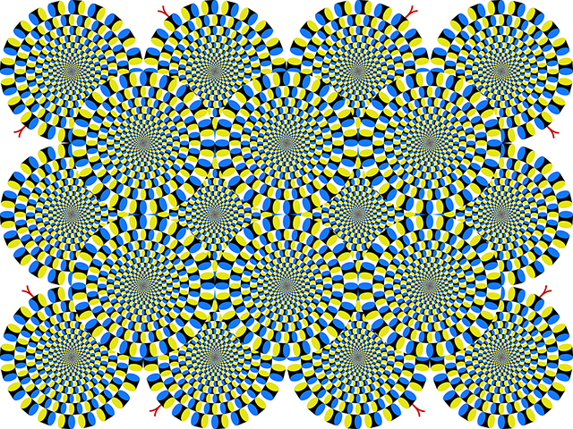
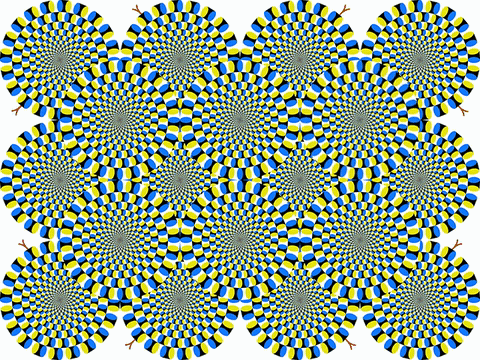

# Which One Is Real? — 蛇の回転錯視 × 現代アート

**「全てが回転して見える。しかし、本当に回転しているのはひとつだけ。」**

北岡明佳教授の「蛇の回転錯視（Rotating Snakes Illusion）」を素材に、錯視と物理的回転の境界を問うインタラクティブアート作品です。



## コンセプト

蛇の回転錯視は、静止画であるにもかかわらず、円形ディスクが回転して見える強力な運動錯視です。この作品では、画像中央に並ぶ6個のディスクのうち1個を**実際に回転**させます。20秒かけて1回転し、5秒間静止した後、別のディスクがランダムに選ばれて回転を始めます。

観察者は「全てが動いて見える」錯視の中から「本物の回転」を見つけ出すという、知覚と現実の境界に立たされます。興味深いことに、蛇のパターンは準回転対称であるため、ゆっくりとした物理的回転は錯視による見かけの回転と区別が極めて困難です。

## ファイル構成

| ファイル | 用途 |
|---|---|
| `generate_animation.py` | MP4 / GIF 生成スクリプト |
| `KitaokaPosi_640.jpg` | 元画像（北岡明佳教授による蛇の回転錯視） |

## 使い方

### 必要環境

- Python 3.8+
- Pillow / NumPy（`pip install Pillow numpy`）
- ffmpeg（パスが通っていること）

### 実行

```bash
# KitaokaPosi_640.jpg と同じディレクトリで
python generate_animation.py
```

カレントディレクトリに以下が出力されます。

| 出力ファイル | 用途 |
|---|---|
| `rotating_snakes.mp4` | 展示・SNS投稿用（高画質、約5MB） |
| `rotating_snakes.gif` | Twitter/X 自動再生・プレビュー用（約4MB） |

一時ファイルは生成しません。フレームはメモリ上で生成し、パイプ経由で ffmpeg に直接渡しています。

### カスタマイズ

`generate_animation.py` 冒頭の設定値を変更できます。

```python
ROTATION_SPEED = 20.0    # 1回転にかかる秒数（大きいほどゆっくり＝判別困難）
ROTATION_SECS = 20.0     # ディスクを回転させる時間（秒）
PAUSE_SECS = 5.0         # 回転後の静止時間
NUM_CYCLES = 3           # サイクル数（ディスクが入れ替わる回数）
DISK_PLAN = None         # 回転ディスクの順番。Noneでランダム、[4,1,3]等で固定
ROTATION_DIRECTION = "random"  # "cw"=時計回り / "ccw"=反時計回り / "random"=毎回ランダム
FIRE_EFFECT = False      # True で回転中のディスクに炎エフェクトを追加
SEED = None              # ランダムシード。Noneで毎回異なる結果、整数で再現可能
```

`ROTATION_SPEED` と `ROTATION_SECS` は独立に設定できます。たとえば `ROTATION_SPEED=20, ROTATION_SECS=30` なら、20秒で1回転する速さで30秒間回り続けます（1.5回転）。`ROTATION_SPEED` を30〜40秒に伸ばすと、錯視との区別がさらに難しくなります。

### ディスク番号

```
┌─────────────────────────────┐
│     [0]     [1]     [2]     │  上段
│        (160,160) ...        │
│     [3]     [4]     [5]     │  下段
│        (160,320) ...        │
└─────────────────────────────┘
```

## 技術メモ

- ディスクは元画像から円形マスクで切り出し、PIL の `rotate()` で回転後に元位置へ再合成しています
- 蛇の回転錯視のパターンは準回転対称のため、90度回転時でもピクセル差分の最大値は42/255程度と小さく、これが「本物の回転が見分けにくい」という作品効果の物理的根拠になっています
- GIF は ffmpeg の palettegen/paletteuse パイプラインで最適化（差分モード + Bayer ディザリング）
- フレームはパイプ経由で ffmpeg に直接渡すため、一時ファイルを生成しません
- 炎エフェクトは FBM（Fractional Brownian Motion）ノイズで生成。AI画像生成は使用せず、純粋な数値計算でディスク縁から上方向に揺らめく炎テクスチャを合成しています

## クレジット

- 蛇の回転錯視（原画像）: **北岡明佳**（立命館大学）
- アート作品制作: エイジ（英治）

## ライセンス

元の錯視画像の著作権は北岡明佳教授に帰属します。本作品を公開・展示する際は、元画像の使用許諾を別途ご確認ください。

## 作例

